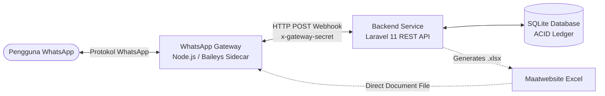

# 💰 WhatsApp Personal Finance Bot (Chatbot Money Save)

[](https://laravel.com)
[](https://www.php.net)
[](https://www.typescriptlang.org/)
[](https://github.com/WhiskeySockets/Baileys)
[](https://www.sqlite.org/)
[](https://pestphp.com/)

**WhatsApp Personal Finance Bot** adalah asisten pencatat keuangan pribadi otomatis yang bekerja langsung di dalam aplikasi **WhatsApp**. Pengguna dapat mencatat pemasukan dan pengeluaran harian semudah mengirim pesan teks biasa (menggunakan bahasa percakapan sehari-hari), memantau saldo mutasi real-time, melihat riwayat transaksi, mengekspor laporan Excel (.xlsx), hingga mengelola data via REST API.

---

## 📑 Daftar Isi

1. [Fitur Utama](#-fitur-utama)
2. [Arsitektur Sistem](#-arsitektur-sistem)
3. [Struktur Direktori](#-struktur-direktori)
4. [Prasyarat Sistem](#-prasyarat-sistem)
5. [Panduan Instalasi](#-panduan-instalasi)
6. [Cara Menjalankan](#-cara-menjalankan)
   - [Mode 1: Simulator Terminal (Tanpa WhatsApp)](#mode-1-simulator-terminal-tanpa-hp--wa)
   - [Mode 2: Bot WhatsApp Live (Terkoneksi Penuh)](#mode-2-bot-whatsapp-live-terkoneksi-penuh)
7. [Daftar Perintah & Contoh Penggunaan Bot](#-daftar-perintah--contoh-penggunaan-bot)
8. [Dokumentasi REST API](#-dokumentasi-rest-api)
9. [Automated Testing](#-automated-testing)
10. [Konfigurasi Environment (.env)](#-konfigurasi-environment-env)
11. [Troubleshooting & FAQ](#-troubleshooting--faq)

---

## ✨ Fitur Utama

- 🧠 **Natural Language Parsing (Bahasa Indonesia)**
  - Mendukung penulisan fleksibel: `keluar 25000 nasi padang`, `beli bensin 50rb`, `-35k parkir`.
  - Mendukung pemasukan: `masuk 500000 gaji`, `terima 250k bonus`, `+1.5jt freelance`.
  - Konversi otomatis satuan nominal: `k`, `rb`, `ribu`, `jt`, `juta`, pemisah titik/koma (`25.000`, `1.5jt`).
- 💰 **ACID Ledger & Mutasi Saldo Real-Time**
  - Setiap transaksi mencatat `balance_after` secara akurat.
  - Perhitungan mutasi saldo anti-race condition dengan database transaction lock.
- 📜 **Cek Riwayat & Filter Transaksi**
  - Tampilkan riwayat: `pengeluaran hari ini`, `pengeluaran bulan ini`, `pemasukan hari ini`, `pemasukan bulan ini`.
  - Menampilkan ID transaksi 8-karakter yang ramah di layar smartphone.
- ✏️ **Kelola, Ubah, & Hapus Transaksi**
  - **Ubah**: `ubah transaksi <ID> <nominal> <keterangan>` (rekalkulasi mutasi saldo otomatis).
  - **Hapus / Void**: `hapus transaksi <ID>` (audit trail tetap tersimpan aman).
  - **Undo Cepat**: `batal` untuk membatalkan langsung transaksi terakhir Anda.
- 📊 **Rekap Saldo & Ringkasan Pengeluaran**
  - Cek saldo terkini: `saldo`.
  - Rekap statistik: `rekap hari ini` dan `rekap bulan ini` dengan rincian pengeluaran per kategori.
- 📁 **Export Laporan Excel (.xlsx)**
  - Ketik `export excel` untuk menerima file dokumen spreadsheet langsung di chat WhatsApp.
  - File Excel multi-sheet dilengkapi tabel ringkasan per kategori dan mutasi transaksi lengkap.
- 🏷️ **Kategori Otomatis & Kustom**
  - Auto-categorization pintar berdasarkan kata kunci (cth: "nasi", "kopi" $\rightarrow$ *Makanan & Minuman*).
  - Tambah kategori baru secara mandiri: `tambah kategori Investasi`.
- 🛡️ **Multi-Tenant & Idempotensi Pesan**
  - Data terisolasi ketat berdasarkan WhatsApp JID (`user_jid`).
  - Idempotency guard via tabel `processed_messages` untuk mencegah duplikasi pemrosesan pesan dari WhatsApp.
- 📱 **REST API & Auth OTP WhatsApp**
  - Endpoint REST API berstandar Sanctum untuk dashboard Web (Vue/React) maupun Mobile App (React Native/Flutter).
  - Login menggunakan verifikasi OTP 6-digit yang dikirimkan bot ke WhatsApp pengguna.

---

## 🏗️ Arsitektur Sistem

Sistem ini dirancang menggunakan arsitektur **Decoupled Sidecar Gateway**:



1. **WhatsApp Gateway (`whatsapp-gateway/`)**:
   - Layanan sidecar berbasis **Node.js + TypeScript** menggunakan pustaka `@whiskeysockets/baileys`.
   - Menghubungkan nomor bot WhatsApp via **Pairing Code** (atau QR scan).
   - Meneruskan pesan masuk ke Laravel Webhook dan mengantrekan pesan balasan (*outbound queue*).
2. **Backend Engine (`backend/`)**:
   - Dibangun dengan **Laravel 11**.
   - `TransactionParserService`: Menganalisis pesan teks bahasa Indonesia dengan regex & intent recognition.
   - `FinanceService`: Mengelola ACID database transaction, saldo, kategori, pembatalan, dan rekalkulasi buku kas.
   - `ExportController` & `FinancialReportExport`: Menghasilkan file Excel multi-sheet.

---

## 📁 Struktur Direktori

```text
chatbot-money-save/
├── backend/                        # Service Backend Laravel 11
│   ├── app/
│   │   ├── Console/Commands/       # Artisan commands (finance:simulate)
│   │   ├── Exports/                # Export Excel (Maatwebsite Excel)
│   │   ├── Http/Controllers/Api/   # WebhookController, TransactionController, dsb.
│   │   ├── Models/                 # Eloquent Models (User, Transaction, Category)
│   │   └── Services/               # TransactionParserService, FinanceService
│   ├── config/                     # Konfigurasi aplikasi & database
│   ├── database/                   # Migrasi, Seeder, dan database.sqlite
│   ├── routes/
│   │   └── api.php                 # Route Webhook & REST API v1
│   ├── tests/                      # Unit & Feature Test (Pest PHP / PHPUnit)
│   └── composer.json
│
├── whatsapp-gateway/               # Sidecar Gateway WhatsApp (Baileys)
│   ├── src/
│   │   ├── index.ts                # Entrypoint Baileys socket & event handler
│   │   ├── queue.ts                # Antrean pengiriman pesan keluar
│   │   └── webhook-client.php / ts # Forwarder pesan ke backend Laravel
│   ├── package.json
│   └── tsconfig.json
│
├── specs/                          # Dokumentasi Spesifikasi Fitur & Data Model
│   └── 001-wa-finance-tracker/
└── README.md                       # Dokumentasi Utama Proyek
```

---

## ⚙️ Prasyarat Sistem

Pastikan perangkat Anda telah terpasang kebutuhan berikut:

| Perangkat Lunak | Versi Minimal | Keterangan |
| :--- | :--- | :--- |
| **PHP** | `^8.2` atau `8.4+` | Ekstensi wajib: `pdo_sqlite`, `mbstring`, `fileinfo`, `zip`, `gd` |
| **Composer** | `2.x+` | Package manager dependensi PHP |
| **Node.js** | `18.x+` atau `22.x+` | Runtime untuk gateway WhatsApp |
| **npm** / **pnpm** | Terpasang | Package manager Node.js |
| **SQLite** | Bawaan PHP | Zero-configuration database lokal |

---

## 🚀 Panduan Instalasi

### 1. Clone Repositori
```bash
git clone https://github.com/TeguhA10/chatbot-money-save.git
cd chatbot-money-save
```

### 2. Setup Backend Laravel
Masuk ke direktori `backend/` dan siapkan environment:
```bash
cd backend

# Salin konfigurasi environment
cp .env.example .env

# Pasang dependensi PHP
composer install

# Buat Application Key
php artisan key:generate

# Buat file database SQLite (Windows PowerShell)
if (!(Test-Path "database\database.sqlite")) { New-Item -Path "database\database.sqlite" -ItemType File }
# (atau di Linux/macOS: touch database/database.sqlite)

# Jalankan migrasi dan seeder kategori default
php artisan migrate --seed
```

### 3. Setup WhatsApp Gateway (Baileys)
Buka terminal baru, masuk ke direktori `whatsapp-gateway/`:
```bash
cd whatsapp-gateway

# Salin konfigurasi environment
cp .env.example .env

# Pasang dependensi Node.js
npm install
```

---

## ▶️ Cara Menjalankan

### Mode 1: Simulator Terminal (Tanpa HP / WA)
Anda dapat menguji seluruh fungsi bot, parser nominal bahasa Indonesia, database, hingga ekspor Excel secara 100% offline langsung di terminal Anda:

```bash
cd backend
php artisan finance:simulate
```

**Contoh Interaksi di Terminal**:
```text
======================================================
  SIMULATOR WHATSAPP BOT CATATAN KEUANGAN (LARAVEL 11)
======================================================
Ketik pesan transaksi Anda (atau 'exit' untuk keluar).

Pesan: masuk 1.5jt gaji bulanan
🤖 Bot:
✅ *Pemasukan Berhasil Dicatat*
━━━━━━━━━━━━━━━━━
📝 Keterangan: gaji bulanan
🏷️ Kategori: 💰 Gaji & Pendapatan
💵 Pemasukan: Rp 1.500.000
━━━━━━━━━━━━━━━━━
💰 Saldo Sekarang: Rp 1.500.000

Pesan: keluar 35k kopi susu
🤖 Bot:
✅ *Pengeluaran Berhasil Dicatat*
━━━━━━━━━━━━━━━━━
📝 Keterangan: kopi susu
🏷️ Kategori: 🍜 Makanan & Minuman
💵 Pengeluaran: Rp 35.000
━━━━━━━━━━━━━━━━━
💰 Sisa Saldo: Rp 1.465.000

Pesan: saldo
🤖 Bot:
💰 Saldo Anda saat ini: *Rp 1.465.000*
```

---

### Mode 2: Bot WhatsApp Live (Terkoneksi Penuh)

Untuk menghubungkan bot ke nomor WhatsApp sungguhan:

#### Langkah 1: Jalankan Backend Server
Di Terminal 1:
```bash
cd backend
php artisan serve
```
*Backend berjalan pada `http://127.0.0.1:8000`.*

#### Langkah 2: Konfigurasi Pairing Phone di Gateway
Buka file `whatsapp-gateway/.env`, masukkan nomor telepon WhatsApp bot Anda (format internasional tanpa tanda `+`, contoh `6281234567890`):
```env
PORT=3000
LARAVEL_WEBHOOK_URL=http://127.0.0.1:8000/api/webhook/whatsapp
GATEWAY_WEBHOOK_SECRET=local_dev_secret_12345
PAIRING_PHONE_NUMBER=6281234567890
```
*(Catatan: Jika `PAIRING_PHONE_NUMBER` dikosongkan, gateway akan memunculkan QR Code di terminal).*

#### Langkah 3: Jalankan WhatsApp Gateway
Di Terminal 2:
```bash
cd whatsapp-gateway
npm run dev
```

1. Terminal akan menampilkan **8 karakter kode pairing**:
   ```text
   =================================================
   📲 KODE PAIRING WHATSAPP: ABC1-234D
   Masukkan kode ini di WhatsApp HP kamu:
   Perangkat Tertaut > Tautkan dengan nomor telepon
   =================================================
   ```
2. Di WhatsApp HP Anda: Buka **Pengaturan / Titik Tiga** $\rightarrow$ **Perangkat Tertaut** $\rightarrow$ **Tautkan Perangkat** $\rightarrow$ Pilih **Tautkan dengan nomor telepon saja**, lalu ketikkan 8 karakter kode pairing tersebut.
3. Setelah tertaut, bot WhatsApp Anda resmi online dan siap melayani pesan! 🎉

---

## 📖 Daftar Perintah & Contoh Penggunaan Bot

Kirimkan format pesan berikut ke nomor WhatsApp bot:

### 1. Mencatat Transaksi
| Kebutuhan | Format / Contoh Pesan | Keterangan |
| :--- | :--- | :--- |
| **Pengeluaran** | `keluar 25000 nasi padang`<br>`beli bensin 50rb`<br>`bayar listrik 150.000`<br>`-35k parkir mall` | Mengurangi saldo, kategori ditentukan otomatis sesuai kata kunci |
| **Pemasukan** | `masuk 5000000 gaji bulanan`<br>`terima 250k bonus proyek`<br>`+1.5jt freelance website` | Menambah saldo dompet |

> **Format Nominal yang Didukung:**
> - Angka polos: `25000`
> - Format titik/koma: `25.000` atau `25,000`
> - Satuan k / rb / ribu: `25k`, `50rb`, `100ribu`
> - Satuan juta: `1.5jt`, `2juta`, `5jt`

---

### 2. Memeriksa Riwayat & Saldo
| Perintah | Deskripsi |
| :--- | :--- |
| `saldo` | Menampilkan total saldo aktif Anda saat ini |
| `pengeluaran hari ini` | Daftar 10 transaksi pengeluaran pada hari ini lengkap dengan ID |
| `pengeluaran bulan ini` | Daftar transaksi pengeluaran sepanjang bulan berjalan |
| `pemasukan hari ini` | Daftar transaksi pemasukan pada hari ini |
| `pemasukan bulan ini` | Daftar transaksi pemasukan sepanjang bulan berjalan |
| `rekap hari ini` | Ringkasan total pengeluaran vs pemasukan hari ini per kategori |
| `rekap bulan ini` | Laporan komprehensif pemasukan, pengeluaran, & persentase kategori |

---

### 3. Mengelola Transaksi (Ubah, Hapus, Undo)
| Perintah | Contoh | Keterangan |
| :--- | :--- | :--- |
| `ubah transaksi <ID> <Nominal> <Keterangan>` | `ubah transaksi a82f31c2 75000 makan siang keluarga` | Mengubah transaksi lama dengan ID 8-karakter & otomatis merekakulasi saldo |
| `hapus transaksi <ID>` | `hapus transaksi a82f31c2` | Membatalkan/menghapus transaksi berdasarkan ID & mengembalikan saldo |
| `batal` | `batal` | Membatalkan instan (undo) 1 transaksi terakhir yang baru saja diinput |

---

### 4. Ekspor Data & Kategori
| Perintah | Contoh | Keterangan |
| :--- | :--- | :--- |
| `export excel` | `export excel` | Bot mengompilasi data dan mengirim file `.xlsx` siap download |
| `kategori` | `kategori` | Menampilkan seluruh kategori pengeluaran & pemasukan aktif |
| `tambah kategori <Nama>` | `tambah kategori Investasi` | Mendaftarkan kategori kustom baru untuk akun Anda |
| `bantuan` / `menu` | `bantuan` | Menampilkan panduan lengkap dan cheat sheet perintah |

---

## 🔌 Dokumentasi REST API

Semua endpoint berawalan prefix `/api/v1`. Endpoint terautentikasi membutuhkan header `Authorization: Bearer <sanctum_token>`.

### Authentication (OTP WhatsApp)
- `POST /api/v1/auth/request-otp`
  - Body: `{"phone": "6281234567890"}`
  - *Bot mengirimkan 6 digit OTP ke WhatsApp nomor tersebut.*
- `POST /api/v1/auth/verify-otp`
  - Body: `{"phone": "6281234567890", "otp": "123456"}`
  - Response: `{"token": "1|sanctum_token_here...", "user": {...}}`

### Profil & Transaksi
- `GET /api/v1/profile`: Mendapatkan data profil dan saldo saat ini.
- `GET /api/v1/transactions`: Mengambil daftar riwayat transaksi (mendukung filter `type`, `start_date`, `end_date`, `page`).
- `POST /api/v1/transactions`: Tambah transaksi manual via JSON API.
- `DELETE /api/v1/transactions/{id}`: Hapus/void transaksi.

### Kategori & Analisis
- `GET /api/v1/categories`: Daftar kategori bawaan dan milik user.
- `POST /api/v1/categories`: Tambah kategori kustom.
- `GET /api/v1/analytics/summary`: Ringkasan total income, expense, net savings, dan rasio tabungan.
- `GET /api/v1/analytics/category-breakdown`: Persentase dan nominal per kategori.
- `GET /api/v1/analytics/monthly-trend`: Tren keuangan 6 bulan terakhir.
- `GET /api/v1/export/excel`: Mengunduh file laporan Excel.

---

## 🧪 Automated Testing

Proyek ini telah dilengkapi **68+ Automated Tests** (Unit & Feature Test) menggunakan **Pest PHP**:

```bash
cd backend

# Menjalankan seluruh test suite
php artisan test

# Menguji khusus parser bahasa Indonesia
php artisan test tests/Unit/ParserServiceTest.php

# Menguji integritas transaksi & mutasi saldo ACID
php artisan test tests/Feature/FinanceServiceTest.php

# Menguji ekspor dokumen Excel
php artisan test tests/Feature/ExcelExportTest.php

# Menguji endpoint Webhook Baileys
php artisan test tests/Feature/WebhookTest.php
```

---

## ⚙️ Konfigurasi Environment (.env)

### `backend/.env`
| Variabel | Default | Keterangan |
| :--- | :--- | :--- |
| `APP_URL` | `http://localhost:8000` | URL root backend Laravel |
| `DB_CONNECTION` | `sqlite` | Koneksi database default |
| `DB_DATABASE` | `database/database.sqlite` | Path database SQLite |
| `GATEWAY_WEBHOOK_SECRET` | `change_me_in_production` | Secret token autentikasi webhook dari gateway |

### `whatsapp-gateway/.env`
| Variabel | Default | Keterangan |
| :--- | :--- | :--- |
| `PORT` | `3000` | Port sidecar gateway |
| `LARAVEL_WEBHOOK_URL` | `http://127.0.0.1:8000/api/webhook/whatsapp` | URL endpoint Webhook Laravel |
| `GATEWAY_WEBHOOK_SECRET` | `change_me_in_production` | Secret token (harus sama dengan backend) |
| `PAIRING_PHONE_NUMBER` | *(kosong)* | Nomor HP WhatsApp bot untuk meminta pairing code |

---

## 💡 Troubleshooting & FAQ

### 1. Bagaimana jika sesi WhatsApp terputus atau ingin ganti nomor?
Hapus folder sesi autentikasi Baileys lalu jalankan ulang gateway:
```bash
rm -rf whatsapp-gateway/auth_info_baileys
cd whatsapp-gateway && npm run dev
```

### 2. Apakah bot bisa digunakan oleh banyak orang sekaligus?
**Bisa.** Arsitektur bot mengisolasi saldo, kategori, dan mutasi berdasarkan WhatsApp JID unik (`user_jid`). Data antar pengguna tidak akan pernah tercampur.

### 3. Mengapa ekspor Excel tidak terkirim di WhatsApp?
Pastikan `APP_URL` di `backend/.env` dapat diakses oleh gateway. Jika menggunakan IP lokal atau ngrok untuk testing publik, pastikan path file dokumen diakses via URL yang valid.

---

## 📄 Lisensi

Proyek ini dilisensikan di bawah lisensi open-source [MIT License](LICENSE).
