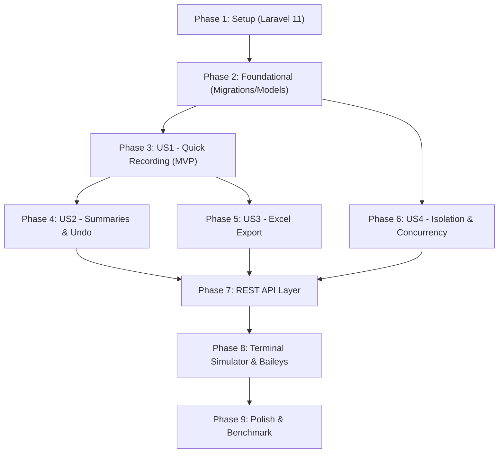

# Tasks: WhatsApp Personal Finance & Expense Tracker Bot (Laravel 11 Core + Baileys Gateway)

**Feature**: `001-wa-finance-tracker` | **Spec**: [spec.md](./spec.md) | **Plan**: [plan.md](./plan.md)

## Phase 1: Setup (Shared Infrastructure)

**Purpose**: Initialize Laravel 11 project structure, dependencies (Composer & npm), and testing framework

- [x] T001 Initialize Laravel 11 project files with composer.json and package.json in repo root
- [x] T002 [P] Install core Composer dependencies (maatwebsite/excel, laravel/sanctum) in composer.json
- [x] T003 [P] Configure environment file (.env and .env.example) for SQLite database and WhatsApp webhook secret

---

## Phase 2: Foundational (Blocking Prerequisites)

**Purpose**: Core database migrations, Eloquent models, and seeders that MUST be complete before ANY user story can be implemented

**⚠️ CRITICAL**: No user story work can begin until this phase is complete

- [x] T004 Setup SQLite database configuration in config/database.php and create database/database.sqlite
- [x] T005 [P] Implement DDL migrations for users, categories, transactions, and processed_messages tables in database/migrations/2026_09_08_000001_create_finance_tables.php
- [x] T006 [P] Implement CategorySeeder with 8 default categories (Makanan, Transport, Belanja, Tagihan, Hiburan, Kesehatan, Gaji, Lainnya) in database/seeders/CategorySeeder.php
- [x] T007 Implement Eloquent models (User, Category, Transaction, ProcessedMessage) with relationships and casts in app/Models/

**Checkpoint**: Core database schema, Eloquent models, and default categories ready. User story implementation can now begin.

---

## Phase 3: User Story 1 - Quick Expense & Income Recording (Priority: P1) 🎯 MVP

**Goal**: Enable users to log daily expenses and income via quick, natural chat messages (e.g. "keluar 25000 makan siang", "+1.5jt gaji") with instant confirmation and balance update.

**Independent Test**: Run `php artisan test tests/Unit/ParserServiceTest.php` and `tests/Unit/FinanceServiceTest.php`; verify balance recalculates accurately and confirmation reply is formatted in under 1.5 seconds.

### Tests for User Story 1 ⚠️

> **NOTE: Write these tests FIRST, ensure they FAIL before implementation**

- [x] T008 [P] [US1] Unit test for Indonesian currency & transaction regex parser in tests/Unit/ParserServiceTest.php
- [x] T009 [P] [US1] Unit test for atomic balance mutation and transaction logging in tests/Unit/FinanceServiceTest.php

### Implementation for User Story 1

- [x] T010 [US1] Implement deterministic regex parser for Indonesian amounts (k, rb, jt) and directional keywords in app/Services/TransactionParserService.php
- [x] T011 [US1] Implement transaction logging business logic and ACID balance calculation in app/Services/FinanceService.php
- [x] T012 [US1] Implement WhatsApp Webhook Controller for incoming transaction messages and confirmation replies in app/Http/Controllers/Api/WebhookController.php
- [x] T013 [US1] Register POST /api/webhook/whatsapp route in routes/api.php

**Checkpoint**: At this point, User Story 1 is fully functional. Transaction logging and balance updates work in Laravel.

---

## Phase 4: User Story 2 - Instant Balance & Periodic Summary Inquiries (Priority: P2)

**Goal**: Enable users to check current balance, view daily/monthly recap summaries, manage custom categories, and safely void mistakes via undo ("batal").

**Independent Test**: Send "saldo", "rekap", "tambah kategori", and "batal" via Webhook test or simulator; verify aggregated totals, new category mapping, and reversed balance snapshots.

### Tests for User Story 2 ⚠️

- [x] T014 [P] [US2] Unit test for summary calculation, category management, and undo logic in tests/Unit/SummaryTest.php

### Implementation for User Story 2

- [x] T015 [US2] Implement summary aggregation methods (daily total, monthly total, category breakdown) in app/Services/FinanceService.php
- [x] T016 [US2] Implement custom category creation and listing methods in app/Services/FinanceService.php
- [x] T017 [US2] Implement transaction undo/voiding with balance refund logic in app/Services/FinanceService.php
- [x] T018 [US2] Wire inquiry commands (saldo, rekap, kategori, tambah kategori, batal, bantuan) into app/Http/Controllers/Api/WebhookController.php

**Checkpoint**: User Stories 1 AND 2 work independently. Users can log, inspect summaries, customize categories, and revert errors.

---

## Phase 5: User Story 3 - On-Demand Excel Spreadsheet Delivery (Priority: P3)

**Goal**: Generate professional multi-sheet Excel workbooks (.xlsx) with an executive dashboard and monthly breakdown sheets using Laravel Excel (Maatwebsite).

**Independent Test**: Run `php artisan test tests/Feature/ExcelExportTest.php`; verify a valid multi-sheet .xlsx file is created containing formatted currency, category distributions, and automated SUM formulas.

### Tests for User Story 3 ⚠️

- [x] T019 [P] [US3] Feature test for multi-sheet Excel generation and formula validity in tests/Feature/ExcelExportTest.php

### Implementation for User Story 3

- [x] T020 [US3] Implement SummaryDashboardSheet with KPI cards, category distribution, and SUM formulas in app/Exports/SummaryDashboardSheet.php
- [x] T021 [US3] Implement MonthlyTransactionsSheet with currency formatting ("Rp"#,##0) and headers in app/Exports/MonthlyTransactionsSheet.php
- [x] T022 [US3] Implement FinanceReportExport coordinating multi-sheet generation in app/Exports/FinanceReportExport.php
- [x] T023 [US3] Implement ExcelExportService and integrate export excel command into app/Http/Controllers/Api/WebhookController.php

**Checkpoint**: All three core user stories functional. Users have complete self-service data ownership via styled Excel spreadsheets.

---

## Phase 6: User Story 4 - High-Concurrency User Isolation & Onboarding (Priority: P4)

**Goal**: Guarantee 100% tenant data isolation across 1,000+ users, provide automatic onboarding greetings, and eliminate duplicate processing during message bursts.

**Independent Test**: Run `php artisan test tests/Feature/TenantIsolationTest.php`; verify zero cross-talk, zero race conditions, and idempotent message deduplication.

### Tests for User Story 4 ⚠️

- [x] T024 [P] [US4] Feature test for multi-tenant isolation and concurrent message bursts in tests/Feature/TenantIsolationTest.php

### Implementation for User Story 4

- [x] T025 [US4] Implement first-time user onboarding welcome guide and automatic user profile initialization in app/Http/Controllers/Api/WebhookController.php
- [x] T026 [US4] Implement message idempotency check using processed_messages table in app/Http/Controllers/Api/WebhookController.php

**Checkpoint**: System validated for 1,000+ active users with robust multi-tenant security and zero data leakage.

---

## Phase 7: REST API Layer (Multi-Client Backend Interface)

**Purpose**: Expose secure REST endpoints defined in contracts/rest-api.md for future Vue 3 Web Dashboard and React Native Expo Mobile App

- [x] T027 [P] Implement AuthController for WhatsApp OTP generation and Sanctum token issue in app/Http/Controllers/Api/AuthController.php
- [x] T028 [P] Implement TransactionController for CRUD and paginated transactions in app/Http/Controllers/Api/TransactionController.php
- [x] T029 Implement CategoryController for category management in app/Http/Controllers/Api/CategoryController.php
- [x] T030 Implement AnalyticsController for summary KPIs, category breakdown, and monthly trend in app/Http/Controllers/Api/AnalyticsController.php
- [x] T031 Implement ExportController for direct binary spreadsheet downloads in app/Http/Controllers/Api/ExportController.php
- [x] T032 Register all API routes and Sanctum middleware in routes/api.php
- [x] T033 [P] Feature test for all REST API endpoints in tests/Feature/Api/TransactionApiTest.php

---

## Phase 8: Local Testing Simulator & Baileys Gateway Sidecar

**Purpose**: Provide an interactive terminal chat simulator in Laravel for 100% offline Windows testing, plus the lightweight Baileys gateway service

- [x] T034 Implement interactive terminal chat simulator Artisan command in app/Console/Commands/FinanceSimulateCommand.php (runnable via php artisan finance:simulate)
- [x] T035 [P] Setup Baileys WhatsApp Gateway project in whatsapp-gateway/package.json and tsconfig.json
- [x] T036 Implement Baileys socket connection, terminal pairing code flow, and webhook relay in whatsapp-gateway/src/index.ts
- [x] T037 Implement outbound rate limiting queue with human-like jitter in whatsapp-gateway/src/queue.ts

---

## Phase 9: Polish & Verification

**Purpose**: End-to-end verification on Windows, automated test suite run, and performance benchmarking

- [x] T038 Execute all test suites via php artisan test and verify 100% passing tests
- [x] T039 [P] Execute end-to-end verification against all scenarios in specs/001-wa-finance-tracker/quickstart.md
- [x] T040 [P] Benchmark regex parser performance (<50ms) and database commit times (<20ms) in tests/Unit/BenchmarkTest.php

---

## Dependencies & Execution Order

### Phase Dependencies

---

## Parallel Execution Opportunities

- **Setup & Foundational**: T002/T003 and T005/T006 can run in parallel.
- **User Story 1**: T008 (Parser Test) and T009 (Finance Test) can run in parallel before service implementations.
- **REST API Controllers**: T027, T028, T029 can be developed in parallel.
- **Simulator & Gateway**: T034 (Artisan simulator) and T035-T037 (Baileys gateway) can be worked on concurrently.
