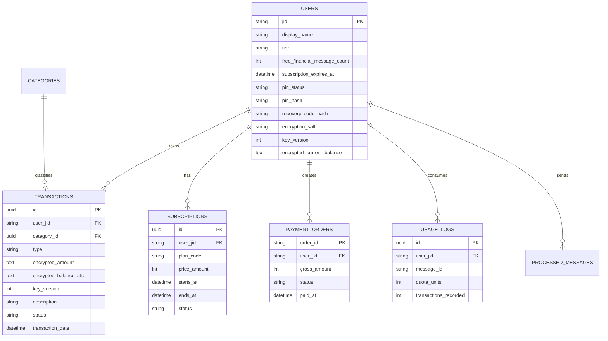

# Data Model: Freemium Subscriptions, Zero-Knowledge Encryption, and Payment Ledgers

**Feature Branch**: `002-freemium-privacy-docker`  
**Date**: 2026-09-10  
**Status**: Completed

---

## 1. Design Goals

The current application already has `users`, `transactions`, `categories`, and `processed_messages`. This feature extends that schema rather than replacing the tenant model:
- preserve `users.jid` as the tenant key,
- replace plaintext monetary fields with encrypted fields,
- add subscription, payment, quota, and PIN recovery state,
- keep idempotency and quota accounting explicit.

---

## 2. Entities

### A. `users` (extended)

Purpose: tenant identity, subscription state, and zero-knowledge credential metadata.

```php
Schema::table('users', function (Blueprint $table) {
    $table->enum('tier', ['FREE', 'PREMIUM'])->default('FREE');
    $table->timestamp('subscription_expires_at')->nullable();
    $table->unsignedInteger('free_financial_message_count')->default(0);

    $table->enum('pin_status', ['PENDING_SETUP', 'ACTIVE'])->default('PENDING_SETUP');
    $table->string('pin_hash')->nullable();
    $table->string('recovery_code_hash')->nullable();
    $table->string('encryption_salt')->nullable();
    $table->unsignedInteger('key_version')->default(1);

    $table->text('encrypted_current_balance')->nullable();
    $table->timestamp('last_pin_verified_at')->nullable();
});
```

Validation rules:
- `free_financial_message_count` in range `0..100` for `FREE` users, unlimited behavior for `PREMIUM`
- `pin_hash`, `recovery_code_hash`, and `encryption_salt` required when `pin_status = ACTIVE`
- `subscription_expires_at` required when `tier = PREMIUM`

Notes:
- `current_balance` plaintext must be retired or backfilled into `encrypted_current_balance`.
- `key_version` supports safe whole-account re-encryption during PIN reset.

### B. `transactions` (migrated from plaintext ledger)

Purpose: user ledger entries with encrypted amount and encrypted running balance snapshot.

```php
Schema::table('transactions', function (Blueprint $table) {
    $table->dropColumn(['amount', 'balance_after']);
});

Schema::table('transactions', function (Blueprint $table) {
    $table->text('encrypted_amount');
    $table->text('encrypted_balance_after');
    $table->unsignedInteger('key_version')->default(1);
});
```

Validation rules:
- `type` is `EXPENSE` or `INCOME`
- encrypted payload columns must decode into valid AES-GCM payload envelopes
- `description` max length follows existing WhatsApp parsing constraints
- only `ACTIVE` rows are counted in current balance and reports

### C. `subscriptions`

Purpose: durable history of user premium periods.

```php
Schema::create('subscriptions', function (Blueprint $table) {
    $table->uuid('id')->primary();
    $table->string('user_jid');
    $table->string('plan_code')->default('MONTHLY_PRO_25000');
    $table->unsignedBigInteger('price_amount')->default(25000);
    $table->timestamp('starts_at');
    $table->timestamp('ends_at');
    $table->enum('status', ['ACTIVE', 'EXPIRED', 'CANCELLED'])->default('ACTIVE');
    $table->string('source_order_id')->nullable();
    $table->timestamps();

    $table->foreign('user_jid')->references('jid')->on('users')->cascadeOnDelete();
    $table->index(['user_jid', 'status']);
});
```

### D. `payment_orders`

Purpose: Midtrans payment intent and webhook idempotency anchor.

```php
Schema::create('payment_orders', function (Blueprint $table) {
    $table->string('order_id')->primary();
    $table->string('user_jid');
    $table->unsignedBigInteger('gross_amount')->default(25000);
    $table->string('currency')->default('IDR');
    $table->string('snap_token')->nullable();
    $table->string('payment_url')->nullable();
    $table->string('payment_type')->nullable();
    $table->enum('status', ['PENDING', 'SETTLEMENT', 'CAPTURE', 'EXPIRE', 'CANCEL', 'DENY'])->default('PENDING');
    $table->timestamp('paid_at')->nullable();
    $table->json('last_webhook_payload')->nullable();
    $table->timestamps();

    $table->foreign('user_jid')->references('jid')->on('users')->cascadeOnDelete();
    $table->index(['user_jid', 'status']);
});
```

### E. `usage_logs`

Purpose: explicit accounting for free-tier consumption per successful financial message.

```php
Schema::create('usage_logs', function (Blueprint $table) {
    $table->uuid('id')->primary();
    $table->string('user_jid');
    $table->string('message_id')->unique();
    $table->unsignedTinyInteger('quota_units')->default(1);
    $table->unsignedInteger('transactions_recorded')->default(1);
    $table->timestamp('consumed_at')->useCurrent();
    $table->timestamps();

    $table->foreign('user_jid')->references('jid')->on('users')->cascadeOnDelete();
    $table->index(['user_jid', 'consumed_at']);
});
```

### F. `processed_messages` (unchanged role, clarified usage)

Purpose: message idempotency before any business mutation.  
Behavior:
- one row per inbound WhatsApp `message_id`
- written before command or transaction execution
- referenced by quota and payment flows to avoid duplicate processing

---

## 3. Relationships



---

## 4. State Transitions

### User PIN state
- `PENDING_SETUP` -> `ACTIVE` when PIN and recovery code are created
- `ACTIVE` -> `ACTIVE` on successful PIN reset with full re-encryption and `key_version + 1`

### User tier state
- `FREE` -> `PREMIUM` on valid Midtrans settlement/capture
- `PREMIUM` -> `FREE` when `subscription_expires_at < now()` and no overlapping active subscription remains

### Payment order state
- `PENDING` -> `SETTLEMENT` or `CAPTURE` on valid paid webhook
- `PENDING` -> `EXPIRE` / `CANCEL` / `DENY` on terminal failure webhook

---

## 5. Encryption Payload Format

Each encrypted value is stored as a serialized payload containing:
- `v`: key version
- `iv`: base64 IV
- `tag`: base64 authentication tag
- `ciphertext`: base64 encrypted integer string

Example logical payload:

```json
{
  "v": 1,
  "iv": "base64...",
  "tag": "base64...",
  "ciphertext": "base64..."
}
```

This format makes re-encryption and validation explicit without storing any decryptable secret in the database.
